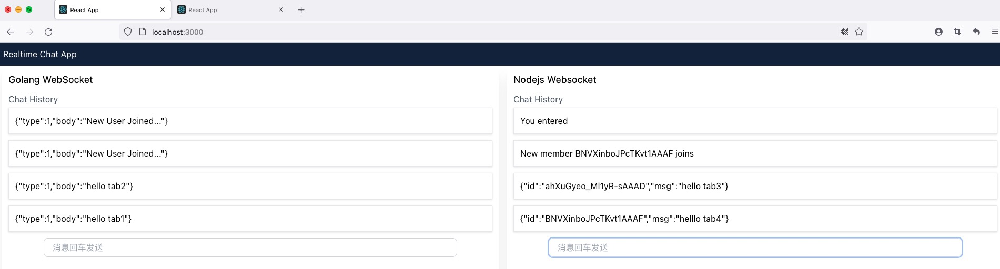
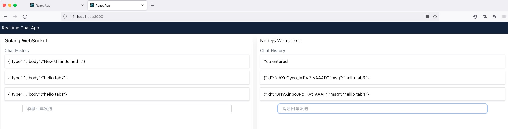
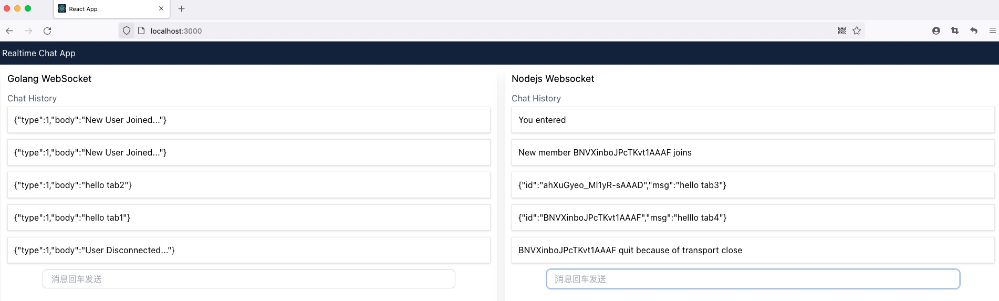

<!--
 * @Author: pipihua
 * @Date: 2021-07-22 22:07:04
 * @LastEditTime: 2021-07-23 15:51:30
 * @LastEditors: pipihua
 * @Description: 说明文档
 * @FilePath: /socket-app/README.md
 * 佛祖保佑永无BUG
-->

# Realization of chat room

## Frontend`react-socket`

### Startup project

```shell
yarn
yarn start
```

## Golang `go-socket`

> All connections are stored in the connection pool, and the coroutines communicate through the channel

### Startup project

```shell
go mod download
go run main.go
```

## Nodejs `node-socket`

> Based on the powerful socket.io library

### Startup project

```shell
yarn
node index.js
```

## When a new member joins



## When communicating



## When a member quits


